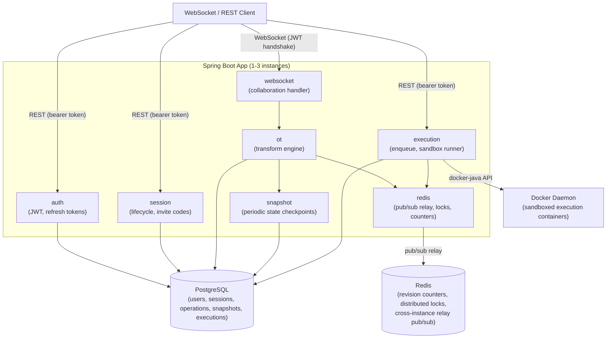

# Collaborative Code Editor

A real-time collaborative code editor backend. Multiple users join coding sessions via WebSocket, edit the same document simultaneously with conflict-free resolution using Operational Transform, and execute code together in Docker-sandboxed containers.

Built with Java 21, Spring Boot 3, PostgreSQL, Redis, and Docker. Designed as a portfolio piece demonstrating distributed systems, real-time algorithms, and containerized execution.

---

## Prerequisites

- **Java 21** (Eclipse Temurin recommended; the Gradle toolchain resolver will auto-provision if missing)
- **Docker 24+** with a running daemon
- **Docker Compose v2** (`docker compose` subcommand, not `docker-compose` v1)
- **Docker socket accessible** at `/var/run/docker.sock` (or override via `DOCKER_SOCKET_PATH` — see Quickstart)

The app container mounts the host Docker socket so it can launch execution sandboxes. Colima users can set `DOCKER_SOCKET_PATH` to their Colima socket path (e.g., `~/.colima/default/docker.sock`).

---

## Quickstart

### Full-stack Compose (canonical path)

**1. Prepare your environment file.**

`.env.example` ships with placeholder values. Fill in the required values (at minimum `APP_JWT_SECRET`) and use it directly, or copy it to `.env` and edit there:

```
APP_DB_URL=jdbc:postgresql://postgres:5432/collabeditor
APP_DB_USERNAME=collabeditor
APP_DB_PASSWORD=collabeditor
APP_REDIS_HOST=redis
APP_REDIS_PORT=6379
APP_JWT_SECRET=<at-least-32-character-random-secret>
```

Optional override for non-default Docker socket (Colima, Rancher Desktop, etc.):

```
DOCKER_SOCKET_PATH=/var/run/docker.sock
```

**2. Build and start the stack.**

```bash
docker compose --env-file .env.example up --build
```

This starts PostgreSQL, Redis, and the Spring Boot app. Flyway migrations run automatically on startup.

**3. Confirm the app is healthy.**

```bash
curl http://localhost:8080/actuator/health
```

Expected response: `{"status":"UP"}`

The app is ready to accept requests once health returns `UP`.

---

### Inner-loop path (infrastructure only)

For faster iteration during development, start only PostgreSQL and Redis with Compose and run the app locally with Gradle:

```bash
# Start only infrastructure
docker compose up postgres redis

# Run the app with local credentials
APP_DB_URL=jdbc:postgresql://localhost:5432/collabeditor \
APP_DB_USERNAME=collabeditor \
APP_DB_PASSWORD=collabeditor \
APP_REDIS_HOST=localhost \
APP_REDIS_PORT=6379 \
APP_JWT_SECRET=<your-secret> \
./gradlew bootRun
```

This skips the Docker image build and uses the Gradle toolchain-resolved JDK directly.

---

## Verification

### Integration test suite

```bash
./gradlew integrationTest
```

Runs all tests tagged `@Tag("integration")` using Testcontainers-backed infrastructure (real PostgreSQL and Redis in Docker). This is the canonical proof command. It covers:

- Flyway schema bootstrapping and JPA validation against PostgreSQL
- Durable OT operation persistence, snapshot creation, and snapshot-plus-replay recovery
- Redis-backed cross-instance collaboration relay behavior
- Docker-backed sandboxed Python and Java code execution

All integration tests require Docker to be running locally (the same daemon used by the execution sandbox).

### Full test suite

```bash
./gradlew test
```

Runs the complete test suite including unit tests, slice tests, and integration tests. Use this to confirm nothing is broken before committing.

---

## REST API

All REST endpoints require a bearer token (`Authorization: Bearer <access_token>`) except `/api/auth/register` and `/api/auth/login`. Tokens are issued at login and rotated at refresh.

### Auth

| Method | Path | Auth | Description |
|--------|------|------|-------------|
| `POST` | `/api/auth/register` | None | Register a new user |
| `POST` | `/api/auth/login` | None | Login; returns access token + sets refresh cookie |
| `POST` | `/api/auth/refresh` | Refresh cookie | Rotate refresh token; returns new access token |

**Register:**

```http
POST /api/auth/register
Content-Type: application/json

{"email": "user@example.com", "password": "secret123"}
```

Response: `201 Created` (no body)

**Login:**

```http
POST /api/auth/login
Content-Type: application/json

{"email": "user@example.com", "password": "secret123"}
```

Response: `200 OK`

```json
{
  "accessToken": "<jwt>",
  "tokenType": "Bearer",
  "expiresIn": 900
}
```

A `ccd_refresh_token` HttpOnly secure cookie is also set. The refresh token is valid for 30 days and rotates on each use.

**Refresh:**

```http
POST /api/auth/refresh
Cookie: ccd_refresh_token=<token>
```

Response: same shape as login. A new `ccd_refresh_token` cookie is set.

---

### Sessions

| Method | Path | Auth | Description |
|--------|------|------|-------------|
| `POST` | `/api/sessions` | Bearer | Create a session; returns invite code |
| `GET` | `/api/sessions` | Bearer | List sessions the authenticated user participates in |
| `POST` | `/api/sessions/join` | Bearer | Join a session by invite code |
| `POST` | `/api/sessions/{sessionId}/leave` | Bearer | Leave a session |

**Create session:**

```http
POST /api/sessions
Authorization: Bearer <token>
Content-Type: application/json

{"language": "PYTHON"}
```

Response: `201 Created`

```json
{
  "sessionId": "550e8400-e29b-41d4-a716-446655440000",
  "language": "PYTHON",
  "inviteCode": "AB3CDEF7",
  "participantCount": 1,
  "ownerId": "..."
}
```

Session language is **immutable** after creation. Supported values: `PYTHON`, `JAVA`.

**Join session:**

```http
POST /api/sessions/join
Authorization: Bearer <token>
Content-Type: application/json

{"inviteCode": "AB3CDEF7"}
```

Invite codes are case-normalized and use the charset `[A-Z2-9]` (excludes 0, 1, I, O). Join is idempotent for already-active participants.

---

### Execution

| Method | Path | Auth | Description |
|--------|------|------|-------------|
| `POST` | `/api/sessions/{sessionId}/executions` | Bearer | Enqueue code execution for the session |

```http
POST /api/sessions/550e8400-e29b-41d4-a716-446655440000/executions
Authorization: Bearer <token>
```

Response: `202 Accepted`

```json
{
  "executionId": "...",
  "status": "QUEUED"
}
```

The execution captures the current canonical room document and language at enqueue time. Results are delivered asynchronously via the WebSocket `execution_updated` event. A per-session cooldown of 5 seconds applies between executions.

**Java execution constraint:** source must be a single-file package-less Main entrypoint (i.e., `class Main { public static void main(String[] args) {...} }`) with no package declaration.

---

## WebSocket Protocol

Connect to the collaboration WebSocket after joining a session via REST.

**Endpoint:** `ws://localhost:8080/ws/sessions/{sessionId}`

Authentication is enforced at handshake time via the `Authorization` query parameter or header:

```
ws://localhost:8080/ws/sessions/{sessionId}?token=<access_token>
```

The user must be an active participant in the session (joined via `/api/sessions/join` or as the session owner). Messages are JSON.

---

### Client to Server

**`submit_operation`** — Submit a document edit.

```json
{
  "type": "submit_operation",
  "baseRevision": 42,
  "operation": {
    "type": "insert",
    "position": 10,
    "text": "hello"
  }
}
```

Or a delete:

```json
{
  "type": "submit_operation",
  "baseRevision": 42,
  "operation": {
    "type": "delete",
    "position": 5,
    "length": 3
  }
}
```

**`update_presence`** — Broadcast cursor/selection position.

```json
{
  "type": "update_presence",
  "cursorPosition": 15,
  "selectionStart": 10,
  "selectionEnd": 15
}
```

---

### Server to Client

| Event | When sent |
|-------|-----------|
| `document_sync` | On WebSocket connect — delivers the current document state and revision |
| `operation_ack` | After the server accepts and commits the submitting client's operation |
| `operation_applied` | After the server commits any operation — broadcast to all other clients in the room |
| `operation_error` | When the server rejects a submitted operation (e.g., invalid base revision) |
| `resync_required` | When the server detects a gap that cannot be resolved; client should reconnect |
| `participant_joined` | When a participant connects to the WebSocket room |
| `participant_left` | When a participant disconnects from the WebSocket room |
| `presence_updated` | When a participant broadcasts a cursor/selection update |
| `execution_updated` | When an execution transitions state: `QUEUED → RUNNING → COMPLETED / FAILED` |

**`document_sync` example:**

```json
{
  "type": "document_sync",
  "revision": 42,
  "content": "def hello():\n    print('Hello')\n"
}
```

**`execution_updated` example:**

```json
{
  "type": "execution_updated",
  "executionId": "...",
  "status": "COMPLETED",
  "stdout": "Hello\n",
  "stderr": "",
  "exitCode": 0
}
```

---

## Architecture



### Subsystems

| Package | Responsibility |
|---------|----------------|
| `auth` | User registration, password hashing, JWT access token issuance, refresh token rotation with reuse detection |
| `session` | Session lifecycle: create, join (invite code), leave, owner transfer, cleanup scheduler |
| `websocket` | Raw WebSocket handler, STOMP-free JSON envelope routing, handshake auth, participant registry |
| `ot` | Server-authoritative Operational Transform engine: transform, apply, and broadcast canonical operations |
| `snapshot` | Periodic document state snapshots every 50 operations; recovery uses latest snapshot plus operation replay |
| `redis` | Distributed revision counters (`INCR`), per-session locks (`SET NX PX`), cross-instance pub/sub relay |
| `execution` | Execution admission, queue management, Docker container lifecycle, sandbox I/O streaming, Redis result relay |

---

## Design Decisions

### server-authoritative OT

The OT engine runs entirely on the server. Every submitted operation is transformed against all unacknowledged canonical operations before being applied. This guarantees that all connected clients converge to the same document state regardless of concurrent edit order. There is no client-side merge.

### snapshot-plus-replay recovery

The server creates a document snapshot at least every 50 canonical operations. On session recovery after restart or cache eviction, the engine loads the latest snapshot and replays only the operations that follow it. This bounds recovery cost without losing full history.

### Redis for 2-3 instance coordination

Redis handles two coordination roles: atomic revision counters (`INCR`) ensure that operation revisions are globally monotonic across instances, and pub/sub relay delivers every accepted operation to all backend instances so their local WebSocket clients stay in sync. Fire-and-forget semantics are acceptable for a 2-3 instance portfolio deployment. A relay gap forces a resync rather than silent divergence.

### Docker-only sandboxing (execution contract)

All code execution runs inside Docker containers with fixed resource and filesystem constraints:

- Max memory: 256 MB
- CPU quota: 0.5 vCPUs
- Execution timeout: 10 seconds
- Filesystem: read-only filesystem (root), writable workspace and `/tmp` are tmpfs mounts
- User: non-root (`uid/gid 65534`)
- Network: disabled

There is no WASM, no in-process execution, and no user-configurable sandbox parameters. The Docker daemon must be accessible to the app container, which requires mounting the host socket at `/var/run/docker.sock`.

### Fixed execution contract

Only two languages are supported, with fixed runtime contracts:

- **Python:** single `.py` file, `python:3.12-slim` image
- **Java:** single-file package-less `Main` entrypoint (`class Main { ... }`), `eclipse-temurin:17-jdk-jammy` image, no package declaration permitted

Session language is set at creation time and cannot be changed. Execution captures the canonical server-side document at enqueue time, not the client's local state.

### Docker socket requirement

The local Compose stack mounts the host Docker socket into the `app` container at `/var/run/docker.sock`. The `DOCKER_HOST` environment variable is set to `unix:///var/run/docker.sock` so `docker-java` auto-discovers it. Colima and Rancher Desktop users must set `DOCKER_SOCKET_PATH` in their `.env` file to point to the correct socket location.
