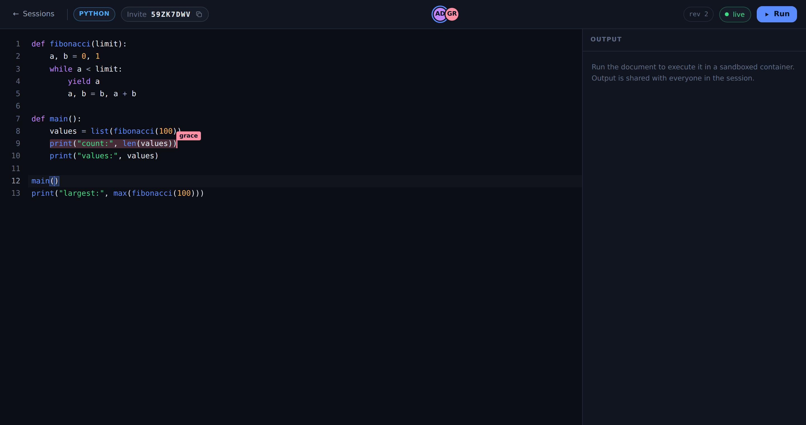
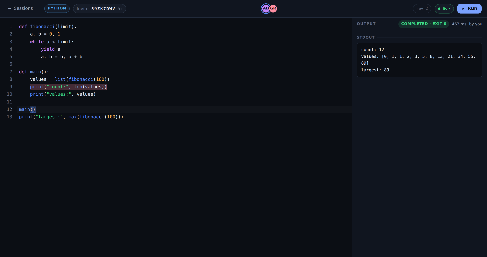
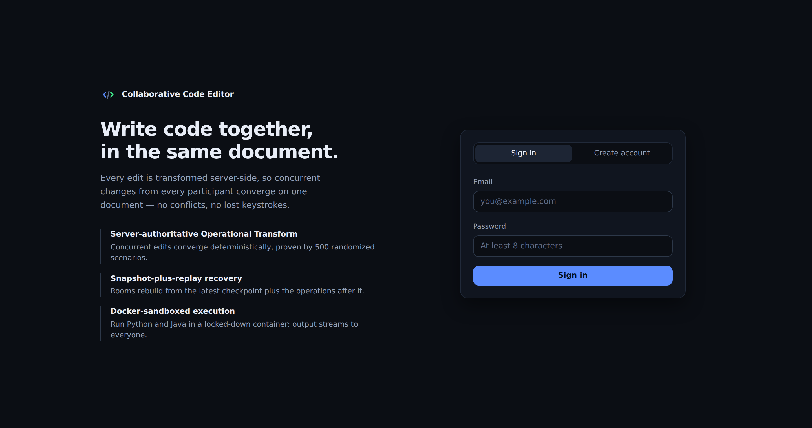
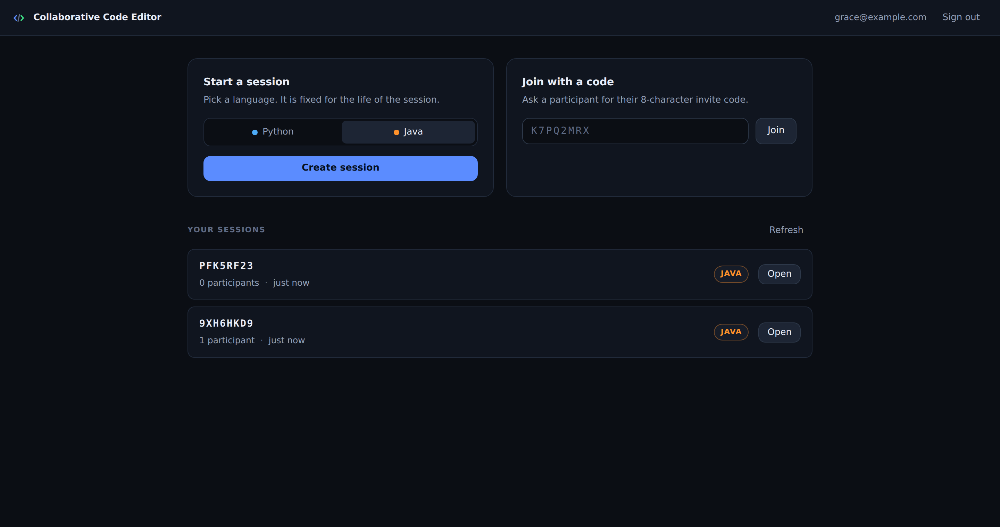

# Collaborative Code Editor

**Real-time collaborative code editing with server-authoritative Operational Transform and Docker-sandboxed execution.**

[](https://github.com/maniic/Collaborative-Code-Editor/actions/workflows/ci.yml)
[](LICENSE)
[](https://adoptium.net/temurin/releases/?version=21)
[](https://spring.io/projects/spring-boot)

<!--
DEMO GIF — record this and replace the image below with docs/images/demo.gif

  Capture at 1440x760, 2x scale if your recorder supports it, ~20 seconds,
  no audio, and export at 12-15 fps so the file stays under ~8 MB.

  Shot list, in one continuous take with two browser windows side by side:
    0:00  Two windows already signed in as different accounts, same session
          open, editor empty.
    0:02  Left window types a short Python function. Right window shows the
          text arriving live, with the left user's coloured caret and name
          label following along.
    0:08  Both windows type at once on different lines, so both carets are
          visible moving simultaneously. This is the money shot — hold it
          long enough to read.
    0:13  Right window presses Run. Both windows show the status pill go
          RUNNING then COMPLETED, with stdout appearing in both consoles.
    0:18  Rest on the finished state showing "by <name>" attribution.

  Then: git add docs/images/demo.gif and swap the  below for it.
-->



Multiple people open the same document and type at once. Every edit is
transformed server-side against the canonical operation log, so all
participants converge on an identical document no matter what order their
keystrokes arrive in. Anyone can run the shared document in a locked-down
container and everyone sees the output.

---

## What makes it interesting

- **Server-authoritative Operational Transform, written from scratch.** No OT
  library. Every submitted operation is transformed against the canonical
  operations committed after its base revision, with a deterministic
  same-position tie-break and TP1-preserving insert/delete handling. Proven by
  a property suite on the server and 500 randomized multi-client convergence
  scenarios against the browser engine.

- **Snapshot-plus-replay recovery.** Document state is checkpointed every 50
  operations. A room that is not cached on the instance serving a connection —
  after a restart, an eviction, or because a second instance took the request —
  rebuilds from the latest snapshot plus the operations after it, without
  discarding history.

- **Multi-instance coordination over Redis.** Atomic `INCR` revision counters
  keep revisions globally monotonic, per-session `SET NX PX` locks serialize
  the apply path, and pub/sub relays every committed operation to sibling
  instances. A detected relay gap forces a resync instead of allowing silent
  divergence.

- **Docker-sandboxed execution.** Python and Java run in containers pinned to
  256 MB, 0.5 vCPU, a 10-second timeout, a read-only root filesystem, tmpfs
  scratch space, no network, and a non-root user. Output streams back to every
  participant over the same WebSocket.

Built with Java 21, Spring Boot 3, PostgreSQL, Redis, and Docker, plus a
zero-build browser client served by the backend itself.

---

## Quickstart

Requires Docker with Compose v2 and a running daemon.

```bash
git clone https://github.com/maniic/Collaborative-Code-Editor.git
cd Collaborative-Code-Editor
cp .env.example .env && echo "APP_JWT_SECRET=$(openssl rand -base64 48)" >> .env
docker compose up --build
```

Then open **http://localhost:8080**. Create an account, start a session, and
open the invite code in a second browser to watch edits merge live.

`APP_JWT_SECRET` is the only value you have to supply — everything else
defaults to the sibling containers. The stack is ready when
`curl http://localhost:8080/actuator/health` returns `{"status":"UP"}`.

---

## Screenshots

Running the shared document in a sandbox — stdout and stderr are separated, and
the result is broadcast to every participant with timing and attribution:



| Sign in | Session lobby |
|---|---|
|  |  |

---

## Verifying it

```bash
./gradlew test              # 254 tests: unit, slice, and integration
./gradlew integrationTest   # 42 integration tests against real containers
node scripts/test-ot-client.mjs
```

The integration suites bring up real PostgreSQL, Redis, and execution sandboxes
via Testcontainers — no host services required, only a Docker daemon.

The convergence harness simulates the server's canonical log plus 2-4 browser
clients making randomized concurrent edits with arbitrary message interleaving,
across 500 seeded scenarios, and asserts every client ends up with the server's
document. It imports the real client engine, so it fails if the browser and
server transform rules ever drift apart.

---

## Documentation

| | |
|---|---|
| [Architecture](docs/architecture.md) | Component diagram, subsystem map, and the reasoning behind the OT, recovery, coordination, and sandboxing decisions |
| [REST API](docs/api.md) | Auth, session, and execution endpoints with request/response shapes |
| [WebSocket protocol](docs/websocket-protocol.md) | Handshake auth and the full client/server event contract |
| [Development](docs/development.md) | Inner-loop setup, test layout, client structure, and configuration |

---

## License

[MIT](LICENSE) © Abdullah Chabaytah
