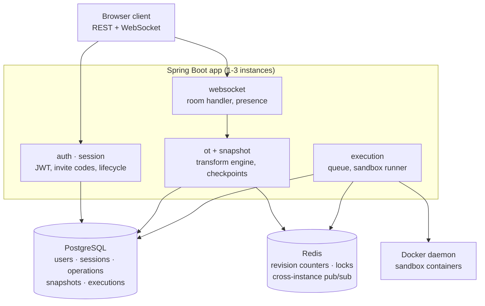

# Architecture

## Subsystems

| Package | Responsibility |
|---------|----------------|
| `auth` | User registration, password hashing, JWT access token issuance, refresh token rotation with reuse detection |
| `session` | Session lifecycle: create, join by invite code, leave, owner transfer, cleanup scheduler |
| `websocket` | Raw WebSocket handler, JSON envelope routing, handshake auth, participant registry, presence |
| `ot` | Server-authoritative Operational Transform engine: transform, apply, and commit canonical operations |
| `snapshot` | Document state snapshots every 50 operations; recovery loads the latest snapshot and replays what follows |
| `redis` | Distributed revision counters (`INCR`), per-session locks (`SET NX PX`), cross-instance pub/sub relay |
| `execution` | Execution admission, queue management, Docker container lifecycle, sandbox I/O streaming, result relay |

---

## Design decisions

### Server-authoritative OT

The canonical OT engine runs on the server. Every submitted operation is
transformed against all canonical operations committed after its base revision,
then applied and assigned the next revision. This guarantees that all connected
clients converge on the same document regardless of concurrent edit order.

The browser mirrors the same transform rules so it can rebase its own pending
edits against incoming canonical operations, but the server's copy is the one
that decides. The two implementations must agree exactly; both are tested
against the same transform properties.

**Same-position insert tie-break.** When two inserts land at the same offset,
the author with the lexicographically smaller user id keeps the left position.
Both sides apply the identical rule, so the ordering is deterministic rather
than arrival-dependent.

**Insert annulled by delete.** An insert falling strictly inside a concurrent
delete range is annulled to a no-op. Repositioning it instead would break TP1:
`apply(apply(doc, a), T(b, a))` and `apply(apply(doc, b), T(a, b))` would
produce different documents. The matching delete-against-insert rule expands
the delete to swallow the inserted text, which is what makes the two orders
agree.

### Snapshot-plus-replay recovery

The server writes a document snapshot every 50 canonical operations. When a
room is not cached on the instance handling a connection — after a restart, an
eviction, or simply because a second instance is serving that user — the
runtime is rebuilt from the latest snapshot plus the operations recorded after
it. This bounds recovery cost without discarding history: the full operation
log stays queryable.

### Redis for 2-3 instance coordination

Redis covers two coordination roles:

- **Atomic revision counters** (`INCR`) keep operation revisions globally
  monotonic across instances.
- **Pub/sub relay** delivers every committed operation to all backend
  instances, so their locally connected WebSocket clients stay in sync.

Per-session locks (`SET NX PX`) serialize the apply path so two instances
cannot commit conflicting revisions for one room.

Fire-and-forget pub/sub is acceptable at this scale. A detected relay gap
forces a resync rather than allowing silent divergence: the receiving instance
evicts its runtime, rebuilds from durable state, and tells its clients to
resynchronize.

### Docker-only sandboxing

All code execution runs inside Docker containers with fixed constraints:

| Constraint | Value |
|---|---|
| Memory | 256 MB (swap capped to the same) |
| CPU | 0.5 vCPU |
| Timeout | 10 seconds |
| Filesystem | Read-only root; `/workspace` and `/tmp` are tmpfs |
| User | Non-root (`65534:65534`) |
| Network | Disabled |

There is no WASM, no in-process execution, and no user-configurable sandbox
parameters — the runner validates its configured limits on every run and
refuses to start if they have been altered.

### Fixed execution contract

Two languages, with fixed runtimes:

- **Python** — single `.py` file, `python:3.12-slim`
- **Java** — single-file package-less `Main` entrypoint,
  `eclipse-temurin:17-jdk-jammy`, compiled then run

Session language is set at creation and cannot change. Execution captures the
canonical server-side document at enqueue time, not the requesting client's
local state, so everyone sees the same program run.

### Docker socket requirement

The Compose stack mounts the Docker daemon socket into the `app` container at
`/var/run/docker.sock`, and sets `DOCKER_HOST` so `docker-java` discovers it.
For Docker Desktop, Linux, and Colima Compose runs the default
`DOCKER_SOCKET_PATH=/var/run/docker.sock` is correct. Override it only if the
daemon itself exposes its socket elsewhere.
